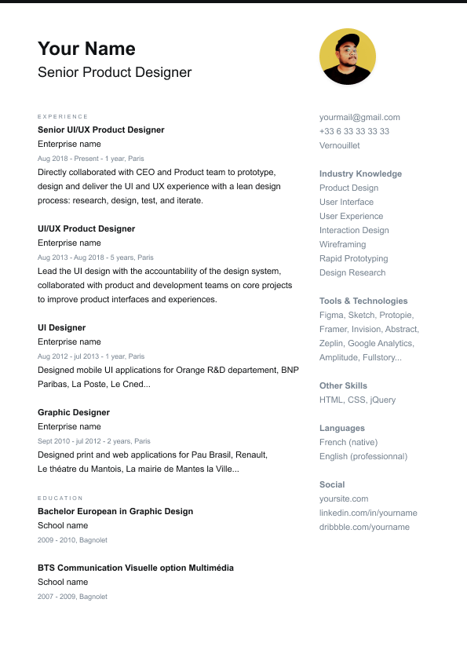
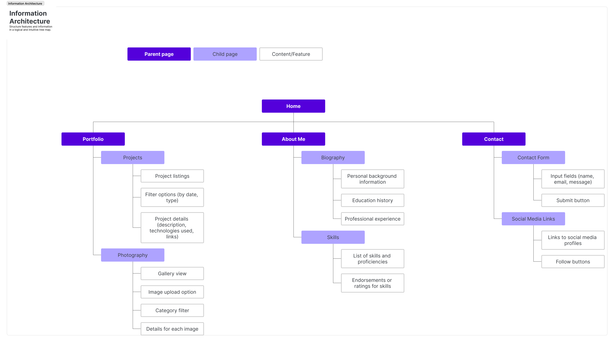

# Lccnet HTML

## 基本語法 index.html
```
<!DOCTYPE html>
<html lang="zh-TW">
<head>
    <meta charset="UTF-8">
    <title>Document</title>
</head>
<body>
    
</body>
</html>
```

## 作業參考 index.html

```
<!DOCTYPE html>
<html lang="en">
<head>
    <meta charset="UTF-8">
    <title>Document</title>
    <link rel="stylesheet" href="https://necolas.github.io/normalize.css/8.0.1/normalize.css">
    <link rel="stylesheet" href="style.css">
</head>
<body>
<div class="container">
    <header>
        <nav>
            <a href="index.html">home</a>
            <a href="portfolio.html">portfolio</a>
            <a href="aboutme.html">about</a>
            <a href="contact.html">contact</a>
        </nav>
        Troie Pan
        Senior Product Designer
        
    </header>
    <main>
        <article>
        experience
        Senior UI/UX Product Designer
        Enterprise name
        Aug 2018 - Present - 1 year, Paris
        Directly collaborated with CEO and Product team to prototype, design and deliver the UI and UX experience with a lean design process: research, design, test, and iterate.

        UI/UX Product Designer
        Enterprise name
        Aug 2013 - Aug 2018 - 5 years, Paris
        Lead the UI design with the accountability of the design system, collaborated with product and development teams on core projects to improve product interfaces and experiences.

        UI Designer
        Enterprise name
        Aug 2012 - jul 2013 - 1 year, Paris
        Designed mobile UI applications for Orange R&D departement, BNP Paribas, La Poste, Le Cned...

        Graphic Designer
        Enterprise name
        Sept 2010 - jul 2012 - 2 years, Paris
        Designed print and web applications for Pau Brasil, Renault,
        Le théatre du Mantois, La mairie de Mantes la Ville...

        education
        Bachelor European in Graphic Design
        School name
        2009 - 2010, Bagnolet

        BTS Communication Visuelle option Multimédia
        School name
        2007 - 2009, Bagnolet
    </article>
    <aside>
        yourmail@gmail.com
        +33 6 33 33 33 33
        Vernouillet

        Industry Knowledge
        Product Design
        User Interface
        User Experience
        Interaction Design
        Wireframing
        Rapid Prototyping
        Design Research

        Tools & Technologies
        Figma, Sketch, Protopie, Framer, Invision, Abstract, Zeplin, Google Analytics, Amplitude, Fullstory...

        Other Skills
        HTML, CSS, jQuery

        Languages
        French (native)
        English (professionnal)

        Social
        yoursite.com
        linkedin.com/in/yourname
        dribbble.com/yourname
    </aside>
    </main>  
</div>
</body>
</html>
```
HTML 標題元素用於定義網頁中的標題或主題，它們用來組織內容，讓瀏覽器和用戶都能清楚地了解網頁結構。HTML 提供了六種標題元素，從 `<h1>` 到 `<h6>`，它們按照重要性依次遞減。

---
### HTML Site Map
網站地圖 (Sitemap) 是一個文件，通常是 XML 格式，用於列出網站的所有頁面，並告訴搜索引擎網站的內容結構。這有助於搜索引擎更有效地抓取和索引網站的頁面。網站地圖可以包含有關每個 URL 的信息，如最後修改日期、變更頻率和相對於其他頁面的優先級。

---

### HTML 標題元素

1. **`<h1>`** - 最高層級的標題，通常用於網頁或章節的主要標題。
   - 範例：
     ```html
     <h1>網站標題</h1>
     ```

2. **`<h2>`** - 用於次級標題，通常是 `<h1>` 標題下的子標題。
   - 範例：
     ```html
     <h2>章節標題</h2>
     ```    
3. **`<h3>`** - 用於次級的子標題，通常用於 `<h2>` 標題下的更細分的標題。
4. **`<h4>`** - 用於 `<h3>` 標題下的進一步細分。
5. **`<h5>`** - 用於 `<h4>` 標題下的細分，較少使用，適合非常深入的分層內容。
6. **`<h6>`** - 最低層級的標題，通常用於 `<h5>` 標題下的內容。

#### 標題使用最佳實踐
- **語義結構**：標題應該按照層次結構合理使用，避免跳級（例如，直接從 `<h1>` 跳到 `<h4>`），這樣有助於維持清晰的文檔結構。
- **SEO 影響**：搜索引擎依賴標題來理解內容的結構和主題，因此合理使用標題標籤有助於 SEO。
- **可訪問性**：正確的標題結構可以幫助使用屏幕閱讀器的用戶更好地導航和理解網頁內容。

#### 其他注意事項
- 每個頁面通常只應有一個 `<h1>` 標題，作為頁面的主標題。
- 標題不僅影響頁面結構，還會影響瀏覽器默認樣式和搜索引擎優化，因此使用時應該謹慎。

這些標題標籤在 HTML 中是必不可少的，因為它們定義了內容的層次結構，使頁面更易於閱讀和理解。

HTML 中的段落是由 `<p>` 標籤定義的。每個 `<p>` 標籤都表示一個獨立的段落，瀏覽器會自動在段落前後添加空白間距，以便更清晰地顯示文本。

### HTML 段落基本用法
- **定義段落**：使用 `<p>` 標籤來包裹段落文本。
  - 範例：
    ```html
    <p>HTML 中的段落是由 p 標籤定義的。每個 p 標籤都表示一個獨立的段落，瀏覽器會自動在段落前後添加空白間距，以便更清晰地顯示文本。</p>
    ```

#### 段落標籤的特點
- **自動換行**：當文本內容超過容器的寬度時，瀏覽器會自動將文本換行。
- **多段落**：可以使用多個 `<p>` 標籤來定義多個段落，每個段落都是獨立的文本區塊。
  - 範例：
    ```html
    <p>這是第一個段落。</p>
    <p>這是第二個段落。</p>
    ```

#### 段落中的其他元素
- **內嵌元素**：段落內可以包含其他內嵌元素，如 `<a>`、`<strong>`、`<em>` 等，用來增加超連結、強調文本或斜體字等。
  - 範例：
    ```html
    <p>這是一個包含 <strong>強調文本</strong> 和 <a href="#">連結</a> 的段落。</p>
    ```

#### 其他注意事項
- **段落內不能嵌套段落**：HTML 規範不允許段落內嵌套其他段落標籤。
- **語義化**：正確使用 `<p>` 標籤可以增強文檔的語義化，使搜索引擎和輔助技術更容易理解內容結構。

段落是 HTML 中最基本的文本區塊元素之一，使用正確的 `<p>` 標籤來組織內容，有助於提升網頁的可讀性和結構清晰度。

在 HTML 中，文字修飾主要是通過一系列標籤和 CSS 屬性來實現的。這些修飾可以改變文本的外觀，例如粗體、斜體、下劃線等。以下是一些常見的 HTML 文字修飾方式：

### HTML 修飾標籤
#### 1. 粗體文字 (`<strong>` 和 `<b>`)
- **`<strong>`**：表示語義上重要的文字，通常顯示為粗體。
  - 範例：
    ```html
    <p>這是一個<strong>重要的</strong>段落。</p>
    ```
- **`<b>`**：僅用來使文字顯示為粗體，沒有語義上的強調。
  - 範例：
    ```html
    <p>這是一個<b>粗體</b>文字。</p>
    ```

#### 2. 斜體文字 (`<em>` 和 `<i>`)
- **`<em>`**：表示強調的文字，通常顯示為斜體，具有語義上的強調意義。
  - 範例：
    ```html
    <p>這是一個<em>強調</em>的段落。</p>
    ```
- **`<i>`**：僅用來使文字顯示為斜體，沒有語義上的強調。
  - 範例：
    ```html
    <p>這是一個<i>斜體</i>文字。</p>
    ```

#### 3. 下劃線文字 (`<u>`)
- **`<u>`**：將文字顯示為帶有下劃線的形式。通常用於表示文本是超連結的一部分，但也可以用來標示需要注意的文字。
  - 範例：
    ```html
    <p>這是一個<u>帶下劃線</u>的文字。</p>
    ```

#### 4. 刪除線文字 (`<del>` 和 `<s>`)
- **`<del>`**：表示被刪除的文本，通常顯示為帶刪除線的形式，適合在修訂過的文檔中標示被刪除的部分。
  - 範例：
    ```html
    <p>這是一個<del>刪除</del>的文字。</p>
    ```
- **`<s>`**：通常用於標示不再準確或不再相關的文本，顯示為刪除線。
  - 範例：
    ```html
    <p>這是一個<s>過時</s>的文字。</p>
    ```

#### 5. 下標與上標文字 (`<sub>` 和 `<sup>`)
- **`<sub>`**：將文字顯示為下標，通常用於數學公式或化學符號。
  - 範例：
    ```html
    <p>H<sub>2</sub>O 是水的化學式。</p>
    ```
- **`<sup>`**：將文字顯示為上標，通常用於指數或註解。
  - 範例：
    ```html
    <p>2<sup>nd</sup> 是第二的縮寫。</p>
    ```

#### 6. 等寬字體 (`<code>` 和 `<pre>`)
- **`<code>`**：用來標示程式碼片段，顯示為等寬字體，適合在文檔中標示代碼。
  - 範例：
    ```html
    <p>請使用 <code>console.log()</code> 來輸出訊息。</p>
    ```
- **`<pre>`**：保留文字中的所有空格和換行，並以等寬字體顯示，適合用來顯示格式化的文本，如程式碼段落。
  - 範例：
    ```html
    <pre>
function test() {
    console.log("Hello, world!");
}
    </pre>
    ```

#### 7. 引用 (`<blockquote>` 和 `<q>`)
- **`<blockquote>`**：用來標示一段較長的引用，通常會增加縮排。
  - 範例：
    ```html
    <blockquote>
      這是一段引用的文字，來自某個來源。
    </blockquote>
    ```
- **`<q>`**：用來標示行內引用，通常會加上引號。
  - 範例：
    ```html
    <p>莎士比亞說過：<q>人生如戲。</q></p>
    ```

#### 8. 強調 (`<mark>`)
- **`<mark>`**：用來高亮顯示文字，表示它在上下文中有重要性或相關性。
  - 範例：
    ```html
    <p>這是一個<mark>高亮顯示</mark>的文字。</p>
    ```

這些 HTML 標籤可以幫助你有效地修飾網頁中的文字，使其更具可讀性和結構性。同時，使用這些標籤還能提升網頁的語義化和可訪問性。

---
### 註解
在 HTML 中，註解（Comment）是一種不會被瀏覽器顯示或渲染的文本，通常用於註釋代碼、標記重要部分或解釋代碼片段的用途。註解對於開發者來說非常有用，有助於增強代碼的可讀性和可維護性。

#### HTML 註解的基本語法

```html
<!-- 這是一個註解 -->
```

註解的內容放在 `<!--` 和 `-->` 之間，瀏覽器會忽略這部分內容。

#### 註解的應用場景

1. **標記代碼段落**：可以用註解來分隔和標記代碼片段，方便以後查看和修改。
   ```html
   <!-- 網頁標題部分開始 -->
   <header>
       <h1>我的網站</h1>
   </header>
   <!-- 網頁標題部分結束 -->
   ```

2. **註釋代碼邏輯**：在代碼中添加註解來解釋複雜的邏輯或操作，使代碼更容易理解。
   ```html
   <!-- 如果用戶已登錄，顯示個人信息 -->
   ```

3. **暫時禁用代碼**：當你需要暫時禁用某段 HTML 代碼時，可以將其包裹在註解中。
   ```html
   <!--
   <div class="disabled-section">
       這段代碼將不會被渲染
   </div>
   -->
   ```

#### 注意事項

- **不嵌套**：HTML 註解不支持嵌套，如果在註解內再插入 `<!--` 或 `-->`，可能會導致註解意外結束或代碼渲染錯誤。
  
- **簡潔明了**：註解應該簡潔明瞭，避免過於冗長。適當的註解能夠幫助其他開發者快速理解代碼。

- **註解不應包含敏感信息**：避免在註解中包含密碼、API 密鑰等敏感信息，因為這些信息可能會被暴露給查看源代碼的用戶。

註解在代碼中扮演著重要的角色，能夠提升代碼的可讀性和可維護性，是開發過程中不可或缺的一部分。

---
### 聯絡資訊
在 HTML 中，`<address>` 標籤用來定義聯絡信息或地址，通常包含電子郵件地址、電話號碼、實體地址等。這個標籤的使用有助於結構化聯絡信息，使其對於搜索引擎和輔助技術更具語義性。

#### `<address>` 標籤的基本用法
- **用途**：用於包裹網頁上某個聯絡人的聯絡信息，通常會在頁腳或關於我們頁面使用。
- **內容**：內容可以包括地址、電話號碼、電子郵件、聯絡人名稱等，並且可以包含內嵌標籤如 `<a>` 來添加超連結。

#### 範例
```html
<address>
    <strong>公司名稱：</strong>Tech Solutions<br>
    <strong>地址：</strong>12345 網路街, 台北市, 台灣<br>
    <strong>電話：</strong><a href="tel:+886123456789">+886 123 456 789</a><br>
    <strong>電子郵件：</strong><a href="mailto:info@techsolutions.com">info@techsolutions.com</a>
</address>
```

#### 注意事項
1. **語義化**：`<address>` 標籤是語義化標籤，使用它來包裹聯絡信息有助於增強網頁的語義結構。
2. **不適合每個聯絡信息**：該標籤專門用於作者或擁有者的聯絡信息，而不應用於其他類型的地址或聯絡方式。例如，不應使用 `<address>` 來包裹顧客的地址。
3. **CSS 樣式**：`<address>` 標籤的默認樣式通常是斜體顯示，但這可以通過 CSS 來調整。

#### 標籤作用
- **SEO 影響**：搜索引擎會識別 `<address>` 標籤，將其內容視為聯絡信息，有助於搜索引擎結果頁面（SERP）顯示正確的信息片段。
- **可訪問性**：對於使用屏幕閱讀器的用戶，`<address>` 標籤提供了語義線索，幫助他們識別網頁上的聯絡信息。

使用 `<address>` 標籤來定義聯絡信息，可以讓網頁內容更加語義化，有助於提升網頁的可讀性、SEO 和可訪問性。

---
### 插入圖片
HTML 中的 `` 標籤用於在網頁中插入圖片。這個標籤是一個自閉合標籤，表示它不需要閉合標籤。下面是 `` 標籤的基本結構及常用屬性：


#### 基本結構
```html

```

#### 常用屬性
1. **`src`（來源）[取得圖片](https://www.pexels.com/zh-tw/)**：
   - 用於指定圖片的路徑，可以是相對路徑或絕對路徑。
   - 範例：
     ```html
     
     ```

2. **`alt`（替代文字）**：
   - 提供圖片的替代文字，用於當圖片無法加載時顯示，或在使用屏幕閱讀器時為用戶讀出。
   - 範例：
     ```html
     
     ```

3. **`width` 和 `height`**：
   - 設定圖片的顯示寬度和高度，可以使用像素（px）或百分比（%）。
   - 範例：
     ```html
     
     ```

4. **`title`**：
   - 提供圖片的標題，當用戶懸停在圖片上時會顯示此文字。
   - 範例：
     ```html
     
     ```

5. **`loading`**：
   - 控制圖片的載入方式，可以設定為 `lazy`（延遲加載）或 `eager`（立即加載）。
   - 範例：
     ```html
     
     ```

6. **`srcset` 和 `sizes`**：
   - `srcset` 用於提供多種圖片文件的列表，以適應不同的屏幕分辨率。
   - `sizes` 定義當前視口條件下，應選擇 `srcset` 中哪個圖片。
   - 範例：
     ```html
     
     ```

#### 其他注意事項
- **SEO 和可訪問性**：為了提升 SEO 和可訪問性，`alt` 屬性應該提供有意義的描述，而不是僅僅重複文件名。
- **圖片格式**：支持的圖片格式包括 JPEG、PNG、GIF、SVG 和 WebP 等，選擇合適的格式可以在保證質量的同時減少加載時間。
- **自適應設計**：在設計響應式網站時，使用 `srcset` 和 `sizes` 可以幫助根據用戶設備的不同自動選擇最佳的圖片。

`` 標籤是 HTML 中非常重要的元素，它不僅僅用於美化網頁，還對於網頁的 SEO 和可訪問性有著重要影響。合理使用 `alt` 屬性、`srcset` 和其他屬性可以提升用戶體驗並優化頁面加載速度。

---
### 列表
在 HTML 中，列表用來組織和顯示一組相關的項目。HTML 支持三種主要類型的列表：有序列表（`<ol>`）、無序列表（`<ul>`）和描述列表（`<dl>`）。

#### 1. 有序列表 (`<ol>`)
有序列表用於表示一組有順序的項目，通常以數字、字母或羅馬數字來標示每個項目。

- **基本結構**：
  ```html
  <ol>
    <li>第一項</li>
    <li>第二項</li>
    <li>第三項</li>
  </ol>
  ```

- **屬性**：
  - `type`：定義列表項的標號類型（數字、字母等）。
    - 範例：
      ```html
      <ol type="A">
        <li>第一項</li>
        <li>第二項</li>
      </ol>
      ```
  - `start`：定義列表從哪個數字開始。
    - 範例：
      ```html
      <ol start="5">
        <li>第五項</li>
        <li>第六項</li>
      </ol>
      ```

#### 2. 無序列表 (`<ul>`)
無序列表用於表示一組無特定順序的項目，通常以圓點、方塊或其他符號標示每個項目。

- **基本結構**：
  ```html
  <ul>
    <li>第一項</li>
    <li>第二項</li>
    <li>第三項</li>
  </ul>
  ```

- **屬性**：
  - `type`：定義項目符號的類型（圓點、方塊等）。
    - 範例：
      ```html
      <ul type="square">
        <li>第一項</li>
        <li>第二項</li>
      </ul>
      ```

#### 3. 描述列表 (`<dl>`)
描述列表用於顯示一組術語及其描述，通常用於定義列表或詞彙表。

- **基本結構**：
  ```html
  <dl>
    <dt>HTML</dt>
    <dd>一種用於建立網頁的標記語言。</dd>

    <dt>CSS</dt>
    <dd>用於描述 HTML 文件樣式的樣式表語言。</dd>
  </dl>
  ```

- **元素**：
  - `<dt>`：定義術語或名稱。
  - `<dd>`：定義術語的描述或解釋。

#### 列表中的嵌套
你可以將一個列表嵌套在另一個列表中，以表示分層結構。例如，在無序列表中嵌套有序列表。

- **範例**：
  ```html
  <ul>
    <li>水果
      <ol>
        <li>蘋果</li>
        <li>香蕉</li>
      </ol>
    </li>
    <li>蔬菜
      <ul>
        <li>胡蘿蔔</li>
        <li>菠菜</li>
      </ul>
    </li>
  </ul>
  ```

HTML 列表提供了靈活的方式來組織和展示相關內容，並且能夠通過 CSS 進行進一步的美化。選擇合適的列表類型可以讓你的網頁更加結構化和易讀。

### 建立連結
HTML 中的 `<a>` 標籤（Anchor Tag）用於創建超連結，這是網頁中最基本的互動元素之一。通過超連結，使用者可以從當前頁面跳轉到其他頁面、文件或位置。

#### 基本結構
```html
<a href="https://www.example.com">訪問範例網站</a>
```
這段代碼會在頁面上顯示「訪問範例網站」的文字，點擊後將帶你到 `https://www.example.com`。

#### 主要屬性
1. **`href`（必填屬性）**：
   - 指定要鏈接到的目標 URL。如果這個屬性沒有設置或空白，`<a>` 標籤不會成為超連結。
   - 範例：
     ```html
     <a href="https://www.example.com">範例網站</a>
     ```

2. **`target`**：
   - 定義連結打開的方式，常見的值包括：
     - `_self`：在同一瀏覽器窗口或標籤中打開（默認行為）。
     - `_blank`：在新窗口或新標籤中打開。
   - 範例：
     ```html
     <a href="https://www.example.com" target="_blank">在新標籤打開範例網站</a>
     ```

3. **`rel`**：
   - 定義連結與當前頁面之間的關係。常見值包括：
     - `noopener` 和 `noreferrer`：當 `target="_blank"` 時，用於安全考慮，防止新開頁面獲取原頁面的 `window.opener`。
     - `nofollow`：告訴搜索引擎不要跟隨此鏈接。
   - 範例：
     ```html
     <a href="https://www.example.com" target="_blank" rel="noopener noreferrer">安全鏈接</a>
     ```

4. **`title`**：
   - 提供連結的額外信息，當用戶將滑鼠懸停在連結上時會顯示。
   - 範例：
     ```html
     <a href="https://www.example.com" title="範例網站的首頁">範例網站</a>
     ```

5. **`download`**：
   - 當連結指向的是文件時，這個屬性會提示用戶下載該文件，而不是在瀏覽器中打開。
   - 範例：
     ```html
     <a href="files/guide.pdf" download>下載指南</a>
     ```

#### 錨點連結
你可以使用 `<a>` 標籤創建錨點連結，以便在同一頁面內快速跳轉到特定部分。

- **定義錨點**：
  ```html
  <h2 id="section1">第一部分</h2>
  ```
  
- **跳轉到錨點**：
  ```html
  <a href="#section1">跳到第一部分</a>
  ```

#### 相對與絕對路徑
- **相對路徑**：指向相對於當前文檔位置的資源。
  ```html
  <a href="about.html">關於我們</a>
  ```
- **絕對路徑**：包含完整的 URL，指向網站上的特定資源。
  ```html
  <a href="https://www.example.com/about.html">關於我們</a>
  ```

#### 超連結的應用
`<a>` 標籤廣泛應用於導航欄、文字鏈接、圖片鏈接、按鈕等。合理使用屬性可以提升用戶體驗並改善網站的 SEO。

HTML 中的 `<a>` 標籤不僅是實現網頁之間連結的基礎，也是豐富用戶互動、提升網站可用性的重要元素。

---
### 空元素
HTML 中的「空元素」是指那些不包含任何內容（例如文本或其他元素）的元素。這些元素通常用來執行特定的功能或表示某些特性，而不需要包含任何內容。空元素在標記語法上是自閉合的，這意味著它們不需要閉合標籤。這類元素主要用於簡化結構並保持標記的簡潔性。

#### 常見的 HTML 空元素
以下是一些常見的 HTML 空元素：

1. **`<br>`**：表示換行。
   - 用於在文本中插入一個換行符號，強制換行。
   - 範例：
     ```html
     這是一段文字。<br>這是新行的開始。
     ```

2. **``**：用來插入圖片。
   - 用於在網頁中顯示圖片，需要設置 `src` 屬性來指定圖片的路徑。
   - 範例：
     ```html
     
     ```

3. **`<input>`**：用來創建各種形式的輸入欄位。
   - 用於表單中，創建文本框、按鈕、選擇框等輸入元素。
   - 範例：
     ```html
     <input type="text" placeholder="輸入你的名字">
     ```

4. **`<hr>`**：表示水平線，用於分隔內容。
   - 通常用來在網頁中分隔不同部分的內容。
   - 範例：
     ```html
     <hr>
     ```

5. **`<meta>`**：用來提供有關 HTML 文件的元數據。
   - 通常用於指定字符編碼、關鍵詞、描述等信息。
   - 範例：
     ```html
     <meta charset="UTF-8">
     ```

6. **`<link>`**：用來定義文件之間的關聯。
   - 通常用於在 HTML 中連接外部資源，如樣式表。
   - 範例：
     ```html
     <link rel="stylesheet" href="styles.css">
     ```

7. **`<source>`**：用來指定多媒體元素（如 `<video>` 和 `<audio>`）的多個資源。
   - 範例：
     ```html
     <video controls>
       <source src="movie.mp4" type="video/mp4">
       <source src="movie.ogg" type="video/ogg">
       瀏覽器不支持該視頻標籤。
     </video>
     ```

8. **`<area>`**：用來定義圖像映射中的區域。
   - 與 `<map>` 元素一起使用，用於創建可點擊區域的圖像映射。
   - 範例：
     ```html
     
     <map name="planetmap">
       <area shape="rect" coords="0,0,82,126" href="sun.htm" alt="Sun">
     </map>
     ```

9. **`<col>`**：用來指定表格中的列屬性。
   - 通常與 `<colgroup>` 一起使用，用於指定表格列的樣式。
   - 範例：
     ```html
     <table>
       <colgroup>
         <col style="background-color:yellow">
         <col style="background-color:green">
       </colgroup>
       <tr><td>1</td><td>2</td></tr>
     </table>
     ```

#### 注意事項
- **自閉合語法**：在 HTML5 中，空元素可以直接使用閉合標籤，如 `<br>`，而不需要在結尾加上斜線 (`/`)。
- **功能用途**：這些空元素的主要功能是簡化代碼結構，並且在沒有內容的情況下能夠實現特定的功能或效果。

空元素在 HTML 中具有重要的作用，能夠使網頁結構更加清晰簡潔，有助於實現網頁的各種功能。
